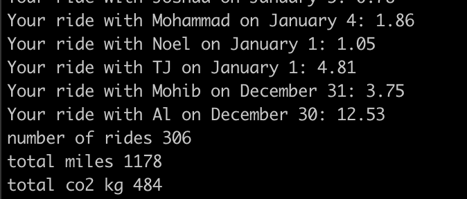

For a while now, I've been dissatisfied with how hard it is for me as an individual to use the data I have wrapped up in various online services. Data has moved from existing locally on my computer to thousands of different cloud services - Gmail, Messenger, Google Docs, etc. These services sometimes offer APIs to get the data out, but it takes a lot of work to actually retrieve it if all you want to do is write a quick script.

A few weekends ago, I set out to see - how hard would it be to write some scripts to scrape my Gmail to learn some numbers about my 2019? Since I've been interested in climate change over the last few months, I decided to focus on examples related to measuring my carbon impact.

First, I'll talk about what I built and where you can get the code, then go over the challenges I had to solve along the way, and finally some conclusions and next steps for future projects.

# Results

To learn about the good and bad parts of scraping one's own email, I built a Node.js script that called the Gmail API to retrieve the following information:

1. Lyft and Uber rides to measure ride distance and carbon impact
2. Flight bookings to measure flight distance and carbon impact
3. Venmo transaction history to sum up top payers/payees

My conclusion from the experiment is that there are a few big hurdles that make email scraping hard initially, but it gets much easier once they are resolved. After these initial hurdles, it felt like I was able to get lots of value out of my data quickly. However, some emails (for example United flight bookings) were much harder to parse programmatically than I expected, so further work is needed to make those tractable.

Lyft + Uber
I started with Lyft and Uber rides, which turned out to be a great example for me to set up the overall email fetching pipeline around a relatively simple problem.

This led me to develop a function I've [called `getAllEmailsFromSearch` in my codebase](https://github.com/stubailo/email-scraper/blob/d9177b7ea96b2dadfe097f83aa8b0bebfd62ad52/src/client.js#L93), which smooths out all of the wrinkles of dealing with the API. I'll cover those details in the "challenges + solutions" section, but after implementing that abstraction I could get all of the emails I was looking for with minimal code.

Then, I could extract the ride distance from the email using a regular expression to look for strings that looked like "12.34mi":

TODO image

Then, it was pretty straightforward to add up the distances and multiply times the carbon emissions per mile for the average car:

Exciting! Getting these initial results got me fired up to tackle a more complex challenge: flights.

## Flights

Gathering flight data from email turned out to be dramatically more complicated primarily because I use a lot of different airlines and systems to book flights: United, Southwest, JetBlue, JSX, Expedia, Chase Travel, and more. These emails don't have a lot in common, and so it feels like each provider needs a special adapter.

My goal was, for each provider, to identify the start and end of each flight, and use that to calculate the distance and therefore the carbon impact. Here was my journey:

- I started with Chase travel, which was pretty reasonable,
- Moved on to Southwest, and got that done,
- I wasn't able to reasonably parse the start/end of a flight out of a United email, and decided to move on

Figuring out how to reasonably parse a diverse set of emails is a problem I hope to think about more in the future - the approach I'm using works well for well-structured, uniform emails from Lyft and Uber, but not for these diverse, sometimes poorly formatted flight system emails.

### Measuring distance and carbon impact of flights

One fun aspect of working on the flights problem was measuring the carbon impact of a flight after determining the start and end airports. For example, if I have a flight from SFO to OGG, how do I figure that out? Here's what I did:

1. I downloaded a [data file from DataHub](https://datahub.io/core/airport-codes) that matches airport codes to latitude and longitude
2. For each pair of airports, I used [a formula I found on Stack Overflow](https://stackoverflow.com/questions/365826/calculate-distance-between-2-gps-coordinates) to determine the number of kilometers between them from the latitude/longitude pairs
3. I multiplied the distance times 0.115, the average kg mass of carbon emissions from one kilometer of flight distance according to [carbonindependent.org](https://www.carbonindependent.org/22.html)

So even though I wasn't able to scrape every single flight from my inbox, I got a good start on the problem:

TODO image

One thing I found is that even the subset of flights I scraped was already many many more kg carbon emissions than my Uber and Lyft rides. It turns out that for people who fly a lot, flights are the overwhelming majority of their carbon emissions.

## Venmo transactions

After the somewhat demoralizing experience of trying to parse complicated airline emails, I decided to cap off by tackling a much easier question - summarizing my Venmo payments for the year.

Thankfully, Venmo puts both the user and amount of the transaction right in the email subject, so with some simple regular expressions I was able to generate a list of the people I pay and who pay me the most:

TODO image

At this point, I ran out of time over the weekend. I was staying with some friends at a startup community in New York called HF0, and my goal was to complete and launch a small project. This was enough examples to make me feel like personal email scraping has a ton of potential.

Let's dive in to some of the challenges with email scraping, and how I solved or didn't solve them.

# Challenges + solutions

One of the premises of my project was that email scraping could be made much less tedious with a little bit of tooling. I feel like that turned out to be true - a few key implementation details made the job much much easier. Here were some of the hardest areas:

1. Authentication
2. Gmail API documentation
3. Performance: filtering and caching
4. Parsing email content

TODO complete
