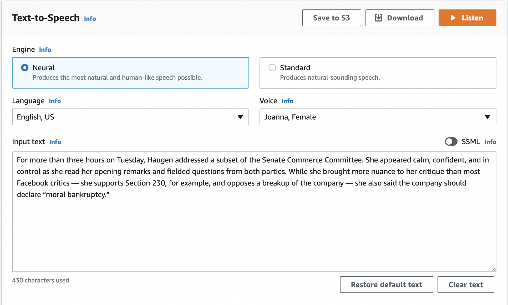
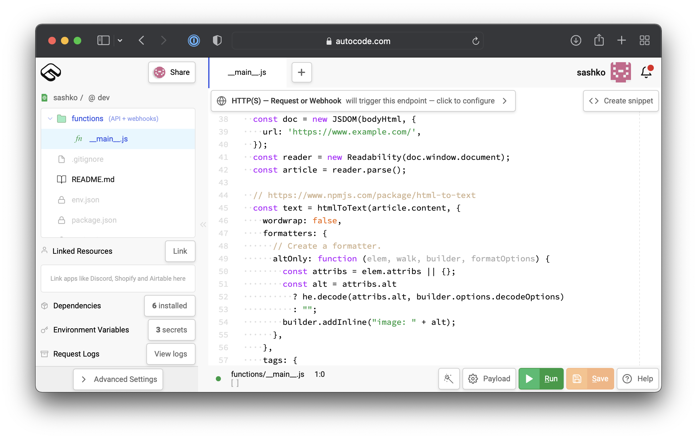
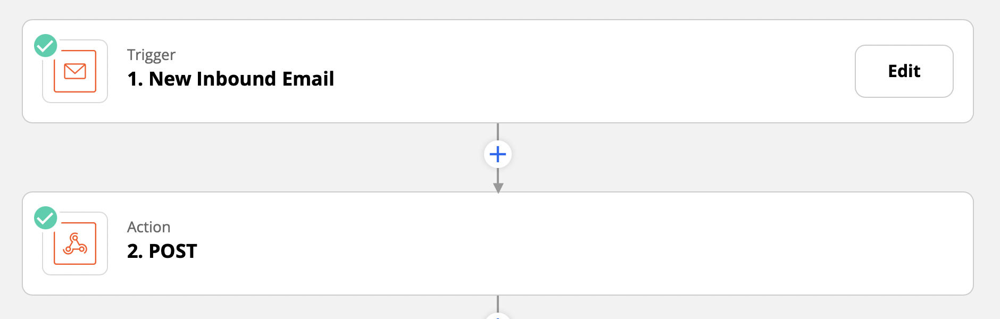
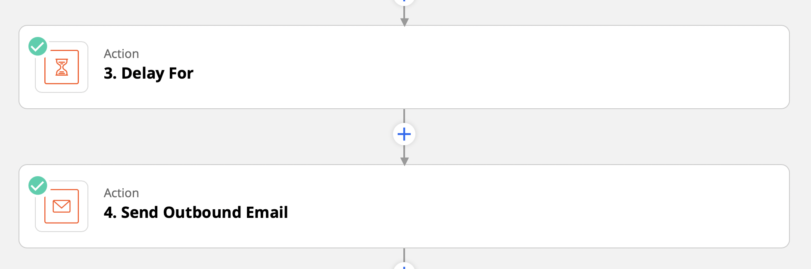
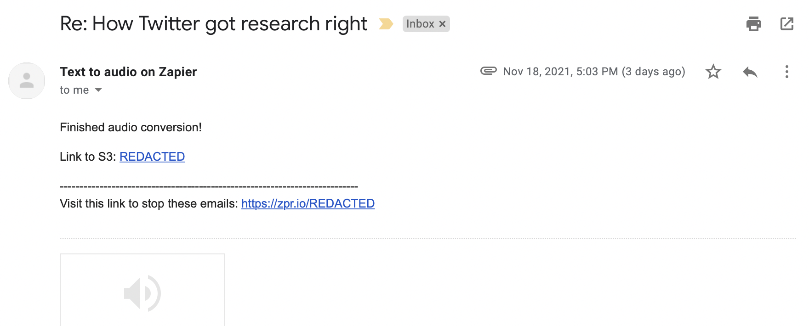

I've been trying to do more walking and running recently, and have found myself wishing that I could catch up on some of my reading along the way. While I know there are many podcasts out there that are ready for listening, one of my favorite things to consume has been Casey Newton's [Platformer newsletter](https://www.platformer.news). So I set out to find out -- could I convert this into audio such that I could listen to it daily rather than reading?

The answer is yes! I've managed to wire together a few different systems to get an mp3 copy of every post in my inbox, minutes after it's published. As a quick overview, here's how it works:

1. Gmail forwards emails from Platformer to [Zapier](https://zapier.com/)
2. Zapier calls a function I've written on [Autocode](https://autocode.com/)
3. Autocode calls [Amazon Polly](https://aws.amazon.com/polly/), which does the conversion and puts an mp3 file on S3
4. Zapier picks up the file and sends it to my email

Now, let's get into the details of each component.

## Amazon Polly -- surprisingly good enough text to speech

My first task was to figure out if I would even want to listen to a robot voice reading a whole newsletter post, so I needed to try it out before building anything. While there are many competing options, I decided to try the AWS option -- Amazon Polly -- first, since I have used AWS before.

You can test Polly's different voices etc straight from the [AWS Console](https://us-west-2.console.aws.amazon.com/polly/home/SynthesizeSpeech). It was surprisingly great! The "Neural" voices are really good at putting together complete sentences, and are a long shot better than the robotic text-to-speech I remember from a few years ago.



Check out Polly reading the first passage of ["The Facebook Whistleblower Testifies"](https://www.platformer.news/p/the-facebook-whistleblower-testifies), one of the free articles on Platformer:

<audio controls>
  <source src="./polly-sample.mp3" type="audio/mpeg" />
  Your browser does not support the audio tag.
</audio>

<br /><br />

I found it very listenable. In fact, I've been listening to ~15 minutes of this voice almost every day for the last few months, so it's really held up over time! Once I ran this test, I had the confidence that this whole thing would work -- I just needed to wire everything up for this conversion to happen automatically.

## Using Autocode to call AWS

I needed a quick place I could get some code running without having to do a lot of administration, bundling, etc. AWS Lambda is great, but as soon as you need to use any NPM packages it's kind of a pain to set up the correct bundling. [Autocode](https://autocode.com/) is a really promising startup focusing on making it super easy to run and deploy a function in the cloud, and so I was excited to finally try it out.



I was really impressed with how easy it was to get a live API running with Autocode, and "installing" an npm package was trivial -- you just use it and it's set up automatically!

Now, let's go over the code:

### Cleaning up the email HTML

One of the first things I realized is that the raw email content that arrives in my inbox from Substack isn't as nicely formatted as what I see in my browser -- it's a jumble of HTML with headings, links, a footer, etc. I needed something like Safari's reader mode, where I would just get the contents of the article.

Thankfully, there's an open source version of the Firefox Reader View on GitHub at [mozilla/readability](https://github.com/mozilla/readability), which got me 90% of the way there:

```js
var {Readability} = require('@mozilla/readability');
var JSDOM = require('jsdom').JSDOM;

const doc = new JSDOM(bodyHtml, {
  url: 'https://www.example.com/',
});
const reader = new Readability(doc.window.document);

// Get cleaned up HTML of the article itself
const article = reader.parse();
```

The Readability library includes a way to get plain text content, but I wasn't super happy with how it converted the HTML of the newsletter into plain text. So instead I got the HTML content out of Readability and processed it on my own with the [html-to-text](https://www.npmjs.com/package/html-to-text) library on NPM, which allowed me to specify exactly how to handle each HTML tag.

```js
const { htmlToText } = require("html-to-text");
const he = require("he");

const text = htmlToText(article.content, {
  wordwrap: false,
  formatters: {
    // A custom formatter so Amazon Polly nicely reads the alt text for images
    altOnly: function (elem, walk, builder, formatOptions) {
      const attribs = elem.attribs || {};
      const alt = attribs.alt
          ? he.decode(attribs.alt, builder.options.decodeOptions)
          : "";
      builder.addInline("image: " + alt);
    },
  },
  tags: {
    a: { format: "inline" },
    blockquote: { format: "inline" },
    h1: { format: "inline" },
    h2: { format: "inline" },
    h3: { format: "inline" },
    h4: { format: "inline" },
    h5: { format: "inline" },
    h6: { format: "inline" },
    hr: { format: "skip" },
    ul: { format: "block" },
    img: { format: "altOnly" },
    // TODO: what to do with tables?
  },
});

console.log('the text', text);
```

### Calling Amazon Polly

Once I was satisfied that the resulting text was something that could be successfully read out by Polly, I wired it up to actually call Polly using the AWS SDK:

```js
const {
  Polly,
  StartSpeechSynthesisTaskCommand,
} = require('@aws-sdk/client-polly');

var s3Params = {
  Engine: 'neural',
  OutputFormat: 'mp3',
  // The audio ends up in an S3 bucket of your choice
  OutputS3BucketName: 'REDACTED',
  Text: text,
  TextType: 'text',
  VoiceId: 'Joanna',
  SampleRate: '22050',
};

const polly = new Polly({
  region: 'us-west-2',
});

const data = await polly.send(new StartSpeechSynthesisTaskCommand(s3Params));

return data.SynthesisTask.OutputUri;
```

I tested this by manually calling the function with some email contents, and checked the output S3 bucket to see if everything worked. Once it did, I moved on to the final step -- getting it to work via email forwarding.

## Zapier for interacting with email

Unfortunately, Autocode doesn't have a native way to run code via email (or at least didn't at the time I built this) so I had to reach for another tool. I'd used [Zapier](https://zapier.com) before and knew it supported email automation, so I went for that.

It was pretty straightforward to set up a Zap to run my Autocode function upon receiving an email:



I sent an email to the address, and indeed an mp3 eventually ended up in my S3 bucket, as expected! But I wasn't satisfied with that -- I also wanted it to send the mp3 file back to my inbox so I could easily listen to it.

Unfortunately, Amazon Polly isn't instant -- it takes a few seconds for the file to actually show up. And I learned that waiting during a Zap -- called "Delay For" -- is actually a paid Zapier feature. So I'm now paying $20 a month for Zapier, specifically for this one component:



If I come back to improve this system, first on my list will be moving off of Zapier to something where I don't have to pay to wait for the file to be sent back.

## Forwarding and reading with Gmail

I was almost there! As the last step, I wanted emails from Platformer to be automatically forwarded to Zapier, so that my mp3 would already be there when I wanted to listen.

I thought that it would be trivial to use Gmail filters to forward emails to an various addresses, but this feature is pretty locked down. I suspect it's for security purposes, or maybe to prevent people from running spambots, but turns out you can only add 5 forwarding addresses to your account, so I have taken up one out of five slots with my Zap.

After adding the forwarding address, it was pretty straightforward to set up a filter to forward to Zapier:


Now, whenever I receive an email from `platformer@substack.com`, it's automatically forwarded to Zapier, which calls Autocode, which calls Amazon Polly, and then the result is sent back to my inbox!

## The result

And... it's been working for a few months now! Every day, I get an email that looks like this:



On mobile, you can listen to it straight from the Gmail app. You can even turn off the phone screen and listen in the background, so it's almost as good as a podcast!

## Conclusion and next steps

First and foremost, this system has helped me have something interesting to listen to while I'm on a walk, and helps me catch up with Casey's excellent writing on the Platformer.

Second, it was an interesting exercise in writing some code and wiring together a few APIs and low-code tools. It's really quite amazing what you can get done these days with just a little code and duct tape.

There are a few things I'd love to improve -- for example, switching out Zapier with something cheaper, creating a better listening experience with some sort of app, and maybe adding another newsletter. But for now it works, and if it ain't broke don't fix it!