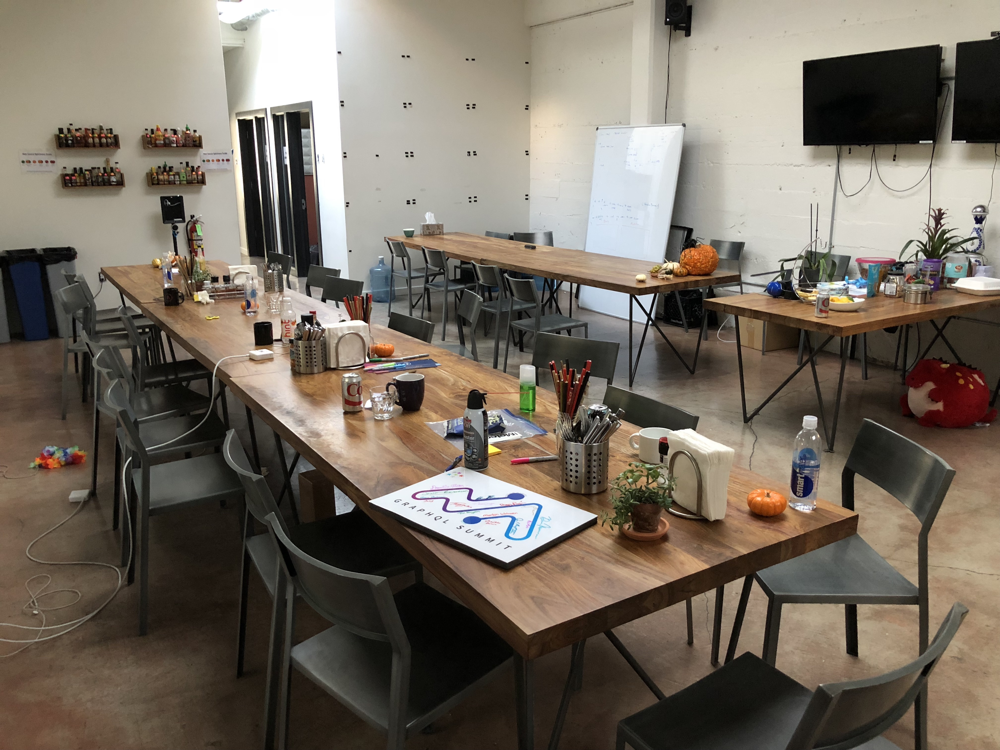

I’ve now been an engineering manager since 2016, first at Apollo and now at Stripe. It’s been long enough that it’s a good time to reflect, and I’m excited to start getting these thoughts written down while they’re still fresh. Hopefully it can be helpful for some people who are considering going from IC to EM, or are just starting out!

This post will focus on how I got started as a manager, and some of the things I learned in my first EM role: leading the open source team at Apollo.

## Transitioning from IC to EM

I first moved into a management role almost 5 years ago at Apollo. At the time, we were just starting to get into GraphQL, while also building the Meteor web framework. I lucked out to be one of the first engineers on what would later become Apollo Client.

During that summer, Apollo Client had just reached the stage where it had a [solid foundation](https://www.apollographql.com/blog/apollo-client-graphql-with-react-and-redux-49b35d0f2641/), and needed a variety of new features built out to get to a production-ready state. Two things happened around that time which made me feel like I’d be happy as an EM.

#### Going farther and faster with a team of interns

Apollo had a pretty exciting intern program for our size: in the summer of 2016, we had 6 interns to maybe 15 full-time engineers. Apollo Client had a lot to do and not a lot of time to catch the momentum around GraphQL, so I felt we could use all the help we could get. Even though it would take time away from direct coding for myself and the other senior engineer on the project, we decided to take on 3 interns.

We had a pretty amazing set of interns that summer -- even though they only had a short 3 months at the company, they were able to plan out new features, build them, get feedback from the community, and launch some of Apollo Client’s most major features. I learned that even if it might be faster in the short term for me to build something myself, we could get a lot more done as a team if I focused on setting the direction, asking the right questions, and coordinating the work.

Empowering teams of people to do more together and figuring out how each person can uniquely contribute to the team is what still fuels my desire to stay in the role.

#### Management as a lever for others

My experience in the early days of Apollo also highlighted the importance of management to a successful engineering team. The number of engineers had grown, but we didn’t yet have dedicated EMs or product managers. It became harder and harder to make sure our work was adding up to something bigger than the sum of its parts. At times it was even a bit discouraging, since you could see people spending a lot of time on things that ultimately weren’t the highest benefit for our users.

I felt that helping organize and prioritize what we were doing wouldn’t just make us more efficient as an organization, but it could also make my colleagues happier -- they would be able to do their best work and better see the impact they were having. They could focus more on what they enjoy and less on administrative work and planning.

It was around that time that we decided to split the engineers into two teams, and I was offered the opportunity to be the EM of what we called the “open source team”.

_The kitchen at the Apollo office. So much nostalgia!_

## Early mistakes and learning

Moving into management was very scary, but also one of the most rewarding experiences of my life. The first thing that hit me was an overwhelming sense of responsibility. Now when I made a mistake, it wasn’t just my problem -- it could affect others in a huge way as well.

Here are some things I learned in my first few years:

1. Actively hand over responsibility
2. When someone on the team isn’t doing well, address it right away
3. To optimize for the long term, don’t think in terms of fixed resources

#### Actively hand over responsibility

As an engineer, you’re in the details of your work every day, making architectural decisions, creating technical debt you’ll handle later, and getting features and bug fixes over the line. When I first switched to a management role, I continued worrying about these things. A lot of it was code that I had originally written, and it was hard to let go.

It took a few months for me to see that this was holding back the team, in particular the people who were best positioned to help. Now that I was in a leadership position, my less-informed ideas would often accidentally overrule the more well-reasoned decisions of the engineers.

It took some direct feedback from my reports to show me that I needed to actively delegate responsibility and let people take their own path. I especially remember two conversations: In one, someone explained that they had a lot of ideas for where to take the project, but didn’t know if they were empowered to make big changes. In another, someone reminded me that delegating important work and decisions was the best way to create growth opportunities for people on the team.

Fully handing over responsibility of Apollo Client’s design to our tech lead which led to excellent designs like the [Apollo Client cache and link system](https://www.apollographql.com/blog/apollo-client-2-0-5c8d0affcec7/). This design, which launched as part of 2.0 in 2017, was the basis for dozens of features and has influenced the overall GraphQL community in the years since.

#### When someone on the team isn’t doing well, address it right away

When it feels like someone isn’t meeting the expectations for their role, or you're seeing warning signs that they are off track, it can be tempting to file it away as an issue to address later. “How bad can it be?” Worst case, I thought, the company is just paying salary to someone who isn’t working at 100%, but it might be an acceptable cost to pay for a while. I was wrong.

It's critical to dig into issues early, and understand what's going on. Make sure that the employee in question is getting the direct feedback they need to understand where they need to improve. The worst situation is one where you as the manager, or others on the team, feel that someone isn't contributing enough, but they haven't heard this feedback. If you let it go for too long, it will make it much harder to turn things around, and will also bring down the morale of the team as a whole.

This is an extremely complicated subject. There are many reasons it may appear that someone is not doing well -- they might have an illness or family situation, it might be the wrong role fit and they should be on another team, or a variety of things. Always try to figure out what will put someone in the best place to succeed. But the important takeaway for me was to do it fast -- don’t wait too long to start having the hard conversations.

#### To optimize for the long term, don’t think in terms of fixed resources

One of my favorite challenges is to figure out how to do more with less. I love finding a neat prioritization or project management trick to get a feature out a month early, or to avoid hiring another engineer. While this works for a while, it’s not a good long term strategy.

You can have an engineer stand in as a writer, or a designer as an engineer, for a while. But if you do it for too long people will be doing work that doesn’t align with their career paths, or you’ll prioritize the wrong work because you’re limited by the team composition you have today.

You need to always be thinking about your constraints -- what’s the ideal team or set of teams to do the work in front of you? Do you have the skills required? Do you need more engineers, or perhaps a designer, a writer, or a product manager?

At Apollo, it took my boss constantly nudging me to realize that we needed more specialized folks for sales enablement, or documentation, or growth. When I left the company, the teams were restructured in a way that enabled people to focus better, promoting capable leaders into new management roles, and I realized this is something I should have done earlier.

## Conclusion

Moving into engineering management was a scary but ultimately rewarding and enriching experience for me. If you’re considering moving into an EM role, or have just started, I hope some of these thoughts are helpful!

If you’re thinking about moving from IC to management, please feel free to reach out to me in a [Twitter DM](https://twitter.com/stubailo) or via email at s.stubailo@gmail.com, and I’d love to answer your questions or provide additional thoughts. Thanks for reading!
