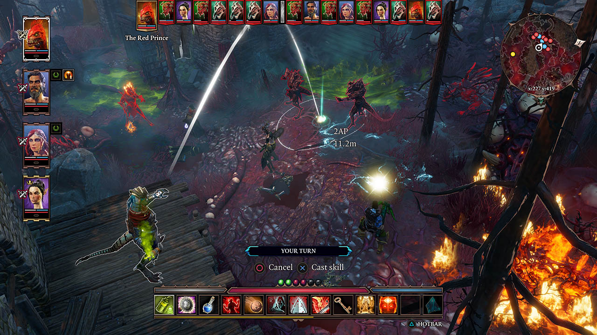
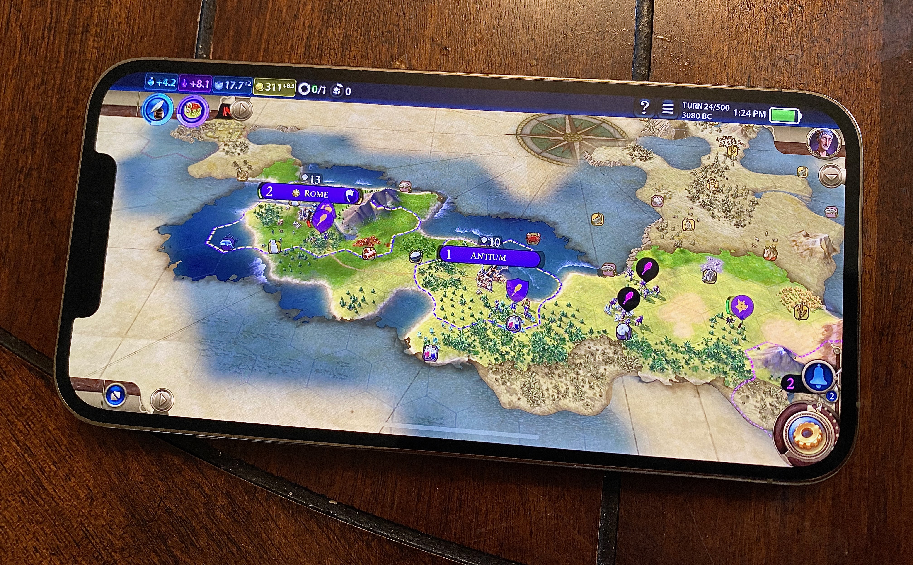
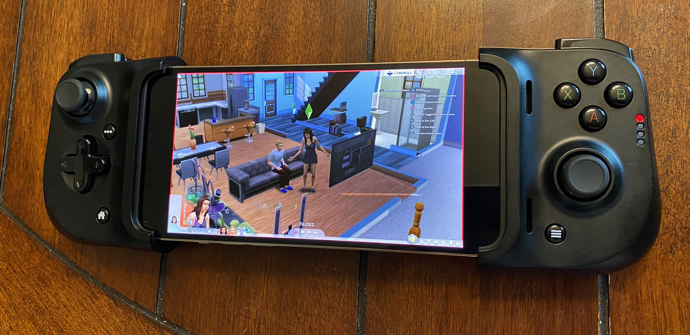
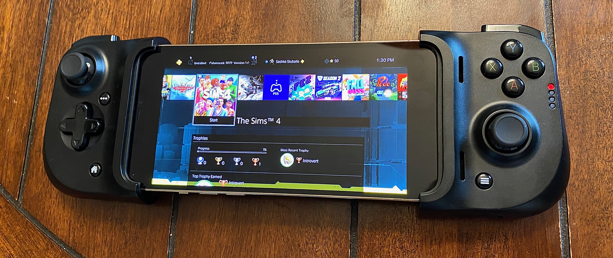
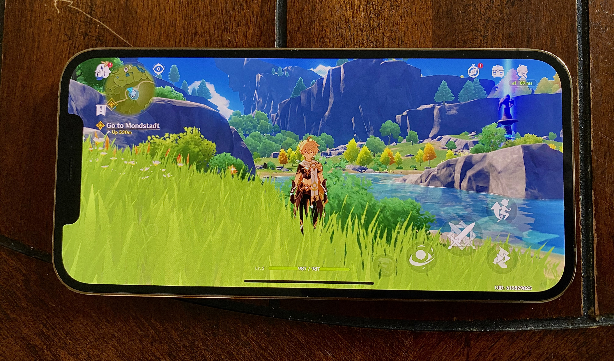

In 2020, there’s been a lot of staying at home and I’ve really gotten back into video games. I’ve been playing a variety of games across many devices (mostly iOS and PS4), and experienced some great stories and gameplay mechanics. Along the way, one thing that’s been interesting is how different games handle the user experience outside the game -- online play, save state management, etc.

Most of the other software I use these days lives in the cloud and syncs across all of my devices. I can access my emails, texts, notes, and photos equally well from my phone or computer, and it’s simple to share them with others. I’d love to live a future where games are the same — you can jump into your game from whatever device you happen to be on, and play with others as easily as you can send a photo from your phone.

In this post, I’ll go over some examples of how various games and technologies handle this, and where they shine or fall short.

## Divinity: Original Sin 2

_Easily switch between split screen and online play_

Divinity is a great D&D-like game where you control a party of up to 4 characters. When players join the game, the host can assign them one or more of the characters to control. I found Divinity by looking for great games that support split-screen co-op, which is sadly getting hard to find these days. Divinity really went above and beyond in this category — if you start a game playing split-screen, you can later join it over the internet and pick up right when you left off, or vice versa.

This works great for a cooperative game that takes a long time to finish. I’ve played games that only support coop online (for example, Borderlands 3), and it’s rough that you need two consoles and two TVs to play in the same room. On the other hand, split-screen only means you can't continue the game if you're not together. Being able to switch between both has been awesome, and I wish more games supported this.

## Civilization VI

_Pushing the boundaries of gaming across mobile and desktop_

The Civilization series is loved by many. Telling yourself "just one more turn" is practically a meme, and the complex decision making and randomly generated scenarios make it so that there are infinite ways any game can turn out. It blew my mind when the complete game was released on iOS. It’s incredible to see a game that used to tax my desktop PC running smoothly on an iPad or an iPhone. They’ve also started porting over the expansion packs with in-app purchases, bringing the full scope of the game to mobile.

Much more recently, they added a feature to sync save files between all of the platforms you play on. Unfortunately it isn't very seamless -- connecting to the online save service often fails, and you have to manually select each game save that you want to be synced across your devices. But it has a lot of promise.

The overall format of the game is nearly perfect for mobile: you can jump in and play a few turns, then take a break when you need to do something else. Civilization VI feels like a glimpse into a future where even very complex PC games can work seamlessly across mobile, tablet, and console.

## The Sims 4

_A relaxing game that’s perfect with PS4 remote play_

The Sims is a classic — one of the few games that reliably gets otherwise non-gamers to spend hundreds of hours in a virtual world. Like Civilization, it would have been a perfect candidate for cross-play between multiple platforms, so you could check on your Sims wherever you are. Unfortunately, the mobile version of The Sims is quite limited and doesn’t hold a candle to the full experience you can get on PS4 or PC. However, I've found a decent workaround in PS4 remote play.

On any phone, tablet, or laptop, you can download the PS4 remote play app and connect to your PlayStation to play games remotely. If you connect a controller (I have the [Razer Kishi](https://www.razer.com/mobile-controllers/razer-kishi/RZ06-03360100-R3U1)), it actually feels great! There’s a bit of lag which means it’s not really feasible to play a reflex-oriented game like Call of Duty, but it’s perfect for The Sims.

There are a few issues — for example, UI elements are a little small to be a great experience on mobile. I think there is huge potential for a cloud-enabled version of The Sims where you can log into your game world from anywhere, but the current crop of simplified mobile versions won't cut it.

## Genshin Impact

_A fully-featured game that launched on all platforms simultaneously_

Genshin Impact has been getting great reviews as a cross platform Zelda-like game. It launched simultaneously on PC, consoles, and mobile, and stands out as a console-quality iPhone experience. As written in [this Vice post](https://www.vice.com/en/article/889zeg/genshin-impact-is-shockingly-good-on-iphone), "it does not seem at all like something you would even attempt to play on mobile; it is the complete package for console or PC," but "it plays near-flawlessly on mobile, seamlessly transitioning from the TV to the phone for a pick-up-where-you-left-off experience."

There’s one big disappointment: it doesn’t support controllers on iOS. Generally, it feels like a missed opportunity that controller-enabled gaming hasn’t taken off on iOS yet. Perhaps with some encouragement from Apple, we'll see more full console-style controller-enabled games on iOS.

## Apple Arcade and game streaming services

_New platforms that simplify the meta-experience around gaming_

This post would be remiss without mentioning two recent platforms that have tried to address some of the questions I mentioned at the beginning.

**Apple Arcade** has a lot going for it: you can get all of the same games across iPhone, iPad, Mac, and Apple TV, most of the games support controllers, and the syncing across devices is usually quite good. Unfortunately, the game selection and quality doesn't really hold a candle to traditional platforms like Steam, PlayStation, or the Switch.

**Game streaming** with Stadia, Geforce Go, or PlayStation Now seems to be picking up recently as well, but I haven't tried it yet, in part because Apple has been stubborn about allowing these experiences in the iOS App Store. This is yet one more area where Apple's overly-restrictive App Store policies have been very disappointing.

## Conclusion

Triangulating between all of the games above, there's an opportunity for a really exciting future where you can access your games across multiple platforms, easily play with your friends both locally and remotely, and play console/PC quality games on mobile.

There is still lots of investment needed from the platform providers and game developers to get us there, but it makes me optimistic that great games will be more accessible than ever before, leaving behind the days where enjoying a new game would require buying super specific hardware or building a tricked-out gaming PC.
